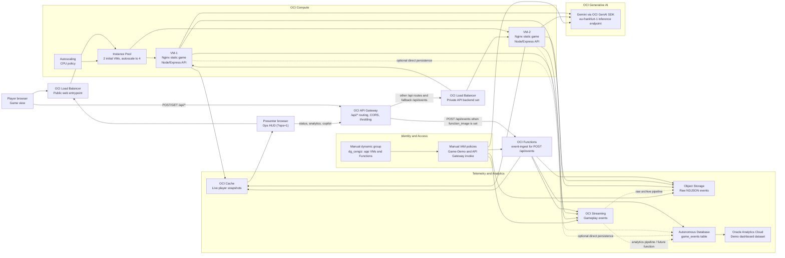
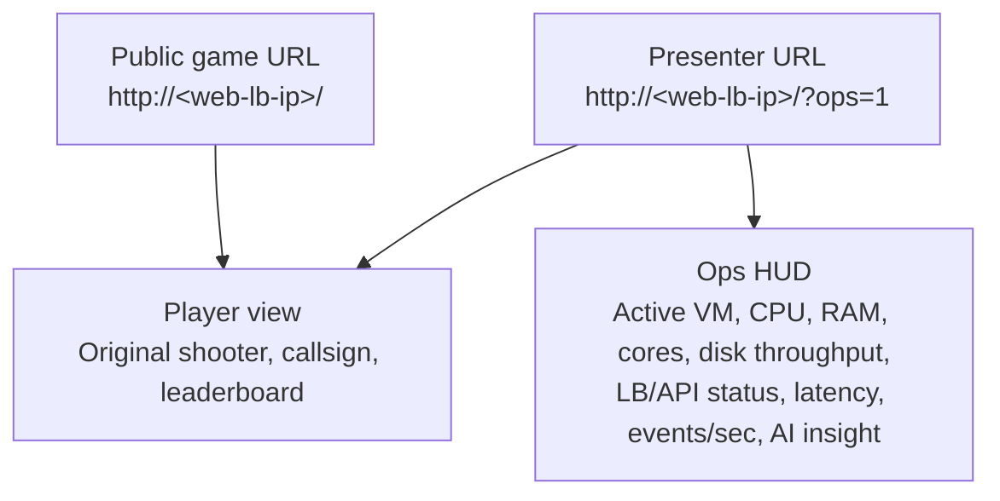

# OCI Defense Grid Wireframe

This wireframe shows how the live demo is connected across the player view, ops view, VM runtime, API layer and OCI services.

## Runtime Flow



## Demo Views



## Service Roles

| OCI service | Role in the demo |
| --- | --- |
| Compute Instance Pool | Runs the static Phaser game and the Node/Express API on multiple VMs. |
| Public Load Balancer | Front door for the game; demonstrates backend health and failover. |
| API Gateway | Enterprise API entrypoint for all `/api/*` browser calls. |
| Private Load Balancer | Routes API Gateway traffic to the VM-backed Express API. |
| Autoscaling | Shows how the VM pool can scale from 2 to 4 instances under CPU pressure. |
| OCI Cache | Keeps live player snapshots shared across all active VM API backends. |
| Streaming | Receives gameplay telemetry events for downstream processing. |
| Object Storage | Stores raw event archives as NDJSON for replay, audit and later analytics. |
| Autonomous Database | Stores curated `game_events` rows for dashboarding and SQL analytics. |
| Oracle Analytics Cloud | Optional dashboard layer on top of ADB. |
| Generative AI | Gemini copilot insight in the ops HUD via OCI GenAI SDK. |
| IAM Dynamic Group and Policies | Manually managed prerequisites. `dg_cengiz` matches app VMs and Functions; `Game-Demo` grants Streaming/Object Storage/GenAI; `oci-defense-grid-apigw-functions` lets API Gateway invoke Functions. |
| OCI Functions | Optional event-ingest backend for `POST /api/events`, used when `function_image` points to an OCIR image. |

## Current GenAI Path

The current Gemini integration uses the native OCI SDK, not the OpenAI-compatible REST path:

```text
Ops browser (?ops=1)
  -> API Gateway /api/copilot
  -> Node/Express
  -> oci-generativeaiinference SDK
  -> https://inference.generativeai.eu-frankfurt-1.oci.oraclecloud.com
  -> Gemini on-demand model OCID
```

The public player view does not call GenAI. Local development uses an OCI security-token profile. Deployed VMs should use instance principal auth through `dg_cengiz` and `Game-Demo`.
